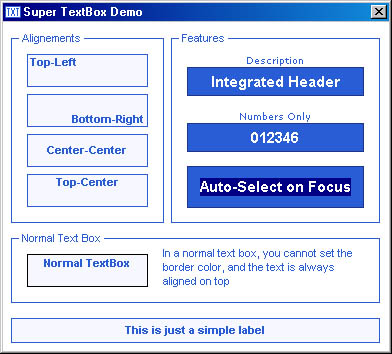



## Customized TextBox

### Description

This is an very very simple activex control that replaces a single line textbox. Features include vertical alignement of the text, text selection on focus, border color, possibility to type only numbers in the box, additional description label. It has a minimalistic and simple look,which i like best.
 
### More Info
 

             |
---                |---
**Submitted On**   |2004-09-16 14:43:56
**By**             |[Lorenzo Nocentini](https://github.com/Planet-Source-Code/PSCIndex/blob/master/ByAuthor/lorenzo-nocentini.md)
**Level**          |Beginner
**User Rating**    |4.4 (22 globes from 5 users)
**Compatibility**  |VB 6\.0
**Category**       |[Custom Controls/ Forms/  Menus](https://github.com/Planet-Source-Code/PSCIndex/blob/master/ByCategory/custom-controls-forms-menus__1-4.md)
**World**          |[Visual Basic](https://github.com/Planet-Source-Code/PSCIndex/blob/master/ByWorld/visual-basic.md)
**Archive File**   |[Customized1794939172004\.zip](https://github.com/Planet-Source-Code/lorenzo-nocentini-customized-textbox__1-56232/archive/master.zip)

